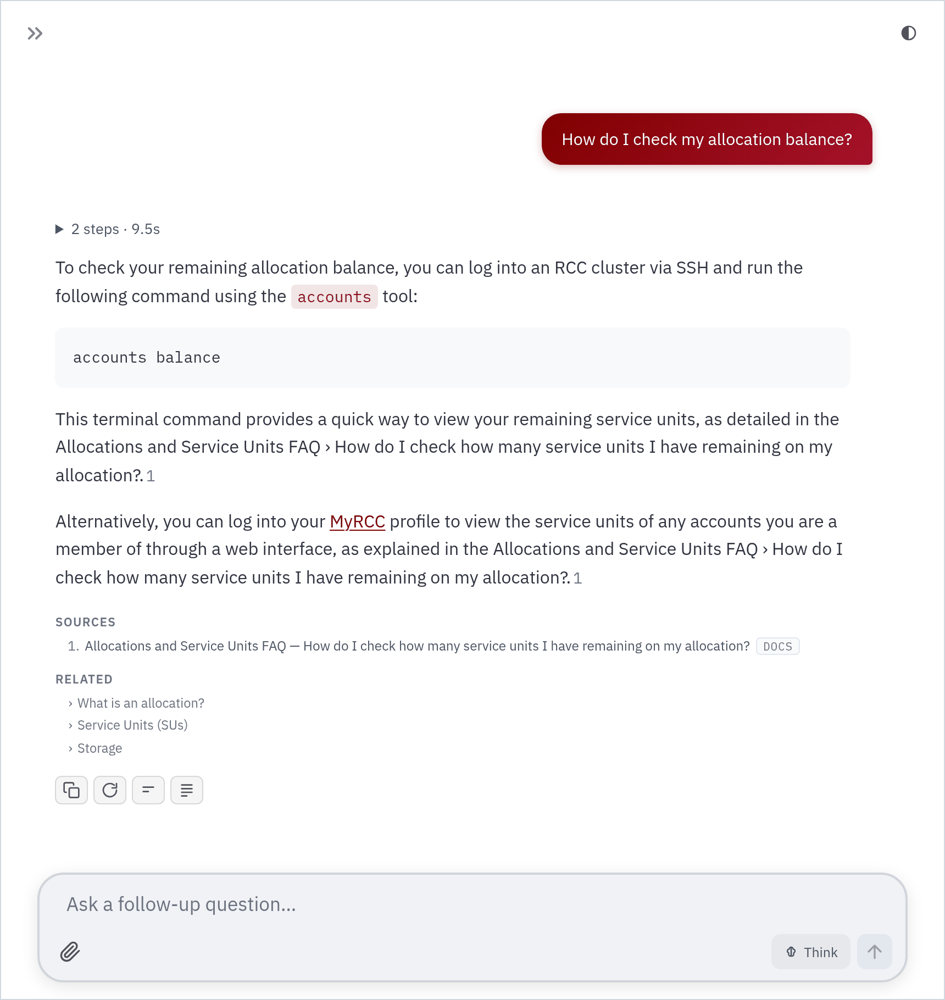

<div align="center">

# 🌱 Sage

**Ask your docs a question. Get an answer that links the exact section it came from.**

Ships with the [UChicago RCC User Guide](https://docs.rcc.uchicago.edu/). Point it at any docs you like.

[**▶ Try it live**](https://sage-48371073389.us-central1.run.app) &nbsp;·&nbsp; [](https://github.com/PursuitOfDataScience/sage/actions/workflows/ci.yml)

<picture>
  <source media="(prefers-color-scheme: dark)" srcset=".github/readme/answer-dark.png">
  
</picture>

</div>

## 🚀 Run it

1. **Install** (Python 3.11):
   ```bash
   git clone https://github.com/PursuitOfDataScience/sage.git && cd sage
   pip install -r requirements.txt
   ```
2. **Add a free key** from [openrouter.ai/keys](https://openrouter.ai/keys) (no balance needed):
   ```bash
   export OPENROUTER_API_KEY=sk-or-v1-...
   ```
3. **Start it** from the repo root, then open <http://localhost:8501>:
   ```bash
   streamlit run app.py
   ```

## ✨ What you get

| Feature | What it does |
| :- | :- |
| 🔗 **Real citations** | Numbered markers link the exact heading, with Sources and Related below. |
| 🙅 **Honest refusals** | When the docs don't cover it, Sage says so instead of guessing. |
| 🔀 **Auto failover** | A model out of quota or replying empty hands the question on. No picker. |
| 🧠 **Think** | A pill in the input box asks the model to reason first, when it can. |
| ⏹ **Stop and edit** | Cut an answer short, reword a question, or queue the next one early. |
| 🔁 **Follow-ups** | Copy, rerun, make it shorter or longer, or select a passage to ask about it. |
| 📎 **Attachments** | PDFs, screenshots, job scripts and logs, up to 10 MB. |
| 💬 **Chat list** | The session's chats in the sidebar, each named after its first question. |
| 🤐 **No shop talk** | Asked how it works, it says what it looks up, never which tools or model. |
| 🌗 **Light and dark** | A remembered theme toggle that never interrupts an answer. |
| ♿ **Accessible** | Keyboard, reduced motion and print all work. |

## ⚙️ How it works

```
question ──▶ search_docs ──────▶ read_doc ───────────▶ answer + numbered citations
             BM25 + synonyms     one whole section
```

- **Read-only.** `read_doc` reads the in-memory index, never the filesystem, so nothing outside the corpus is reachable. Nothing touches your cluster.
- A model that can't call tools gets one retrieval pass up front, with the same citations.
- The bundled RCC docs (`docs/`, `web/`) [refresh themselves every Saturday](.github/workflows/refresh-corpus.yml).

## 🧩 Make it yours

One TOML file is the whole subject: name, icon, welcome copy, starter cards, sources, citation URLs, synonyms, prompt and models.

```bash
cp profiles/rcc.toml profiles/mine.toml        # edit [assistant], [[sources]] and [prompt]
SAGE_PROFILE=profiles/mine.toml streamlit run app.py
```

Nothing under `sage/` names the RCC, and [a test](tests/test_profile.py) fails if anything does. Guide: [`profiles/README.md`](profiles/README.md).

## 🔌 Swap a part

Five registries. A new part is a function and one `register()` call; [`sage/runtime.py`](sage/runtime.py) wires them together.

| To change | Register in | Ships with |
| :- | :- | :- |
| How a file becomes chunks | `corpus.readers` | `markdown`, `scraped` |
| Where a citation points | `corpus.urls` | `mkdocs`, `direct`, `embedded`, `none` |
| How search works | `retrieval.engines` | `bm25` |
| Where models come from | `providers.adapters` | `openai`, `vertex`, `mistral` |
| What the model can call | `tools.factories` | `search_docs`, `read_doc` |

Any OpenAI-compatible server (Together, Groq, vLLM, Ollama) needs no code: `kind = "openai"` and a `base_url` in your profile.

## 📚 More

| Read | For |
| :- | :- |
| [`CONFIG.md`](CONFIG.md) | Every environment variable: rate limits, uploads, login, feedback, docs refresh |
| [`profiles/README.md`](profiles/README.md) | Writing a profile: sources, readers, URL schemes, providers |
| [`deploy/README.md`](deploy/README.md) | Cloud Run. A green CI run on `main` redeploys it. |
| [`EVAL.md`](EVAL.md) | How answers are measured, and the scorecard |
| [`CLAUDE.md`](CLAUDE.md) | Working on the code: where things go, how to run the checks |
